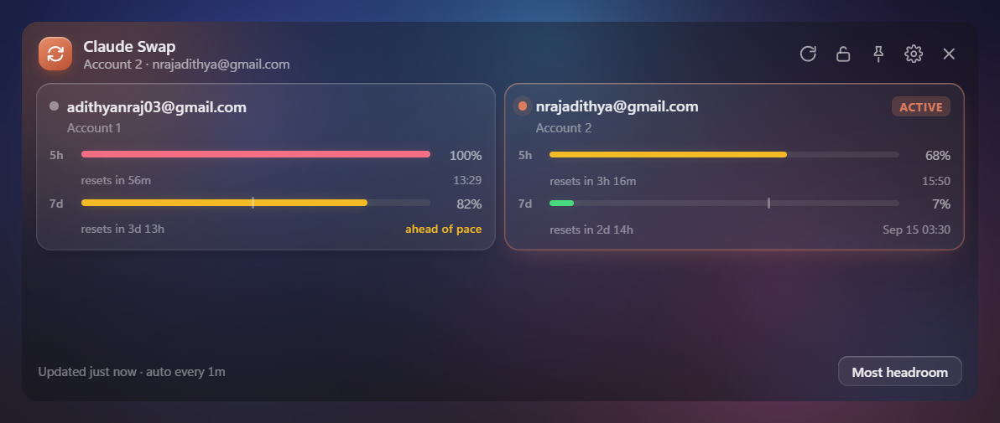
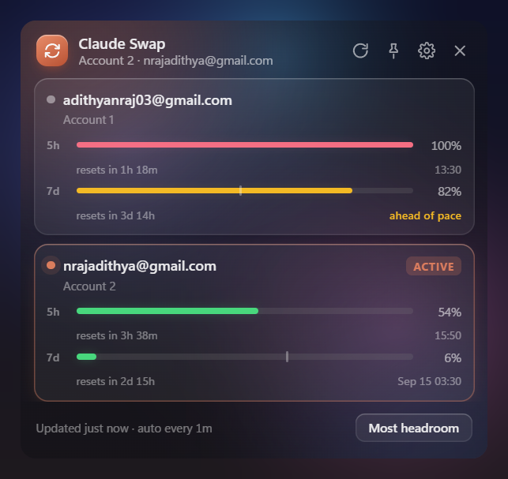
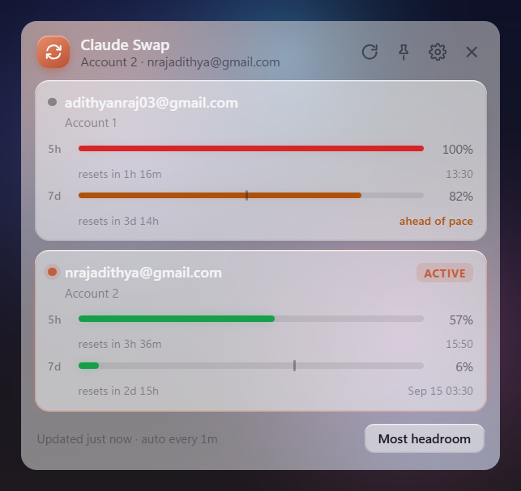
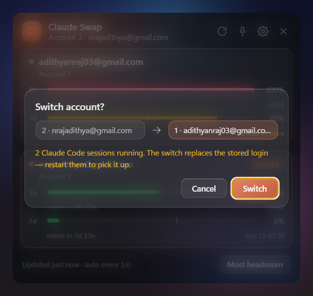
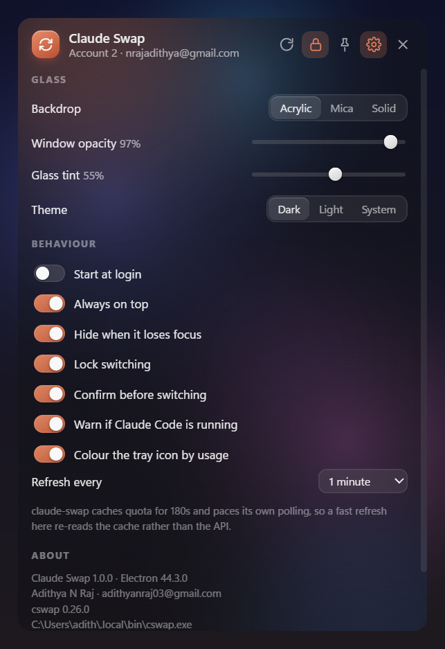

# Claude Swap Desktop

<p align="center">
  
</p>

<p align="center">
  
  
  
  
</p>

**A Windows 11 tray companion for [`claude-swap`](https://github.com/realiti4/claude-swap).**
Left-click the tray icon for a glass popover showing every managed account's 5h / 7d
quota with live reset countdowns; click an account to confirm and switch.
Right-click for the full menu. The CLI stays the source of truth — this app shells
out to `cswap … --json` and renders the result. Nothing about your accounts or
credentials is ever stored here.

---

## Prerequisite: the claude-swap CLI

Claude Swap is a front end, not a credential store — it needs the
[claude-swap](https://github.com/realiti4/claude-swap) CLI installed and managing
at least one account.

```powershell
# 1. install the CLI (Python 3.12+ required; Claude Code must be installed and logged in)
uv tool install claude-swap        # recommended
# pipx install claude-swap         # alternative

# 2. add your first account (be logged into Claude Code with it)
cswap add

# 3. add the next account: open Claude Code, run /login and sign in with
#    the other account, then
cswap add

# 4. verify
cswap list
```

> **Note** — when adding further accounts, never log out of an existing one
> (no `/logout`): Claude Code may revoke the refresh token stored for the
> account you are leaving.

The app auto-detects the CLI at launch on `PATH` and in the well-known install
locations (`~/.local/bin`, the uv tool Scripts dir, Python Scripts, `~/.cargo/bin`,
looking for `cswap` / `cswap.exe` / `claude-swap.exe` / `cswap.cmd`). If it lives
somewhere unusual, point Settings → CLI path at it.

## Install

```powershell
npm install
npm run dist      # builds the installer + portable .exe into dist/
```

Or run straight from source:

```powershell
npm start
```

## Screenshots

<p align="center">
  
  
</p>
<p align="center"><sub>Default list view — 5h / 7d meters and reset countdowns &nbsp;·&nbsp; Light theme</sub></p>

<p align="center">
  
  
</p>
<p align="center"><sub>Confirm sheet — warns about live Claude Code sessions &nbsp;·&nbsp; Settings + about — detected CLI version and path</sub></p>

## What it does

**Tray icon** — a ring showing the active account's 5h usage, coloured green /
amber / red by headroom, with the slot number in the middle. It is redrawn on
every poll, so the taskbar alone tells you where you stand. Hover for a tooltip
with both windows.

**Popover** (left-click) — one card per account: email, slot, organisation, and a
meter for each of the 5h and 7d windows with a live countdown to reset. The 7d
meter carries a tick marking where an even burn rate would have put you by now,
and flags "ahead of pace" when you are over it. Click a non-active card to get a
confirmation sheet, then switch.

**Lock** — the padlock in the header guards against a stray click switching your
account. It is **on by default**: clicking a card while locked just says so and
nudges the padlock, and the tray menu's switch entries grey out. Open the padlock
to switch. Independent of "Confirm before switching", which is the second guard.

**Resizing** — drag any window edge, or the grip in the top-left corner (the
popover hugs the tray corner, so it grows up and to the left). The card grid
reflows as it widens: one column at the default width, two from about 560px,
three from about 830px. Settings go two-column past 620px. Height stops
fitting-to-content once you have sized it by hand; double-click the grip, or use
*Reset size* in Settings or the tray menu, to go back to automatic.

**Menu** (right-click) — switch to a specific account or to whichever has the most
headroom, refresh, open the dashboard, open the `cswap` TUI in a terminal, and
every setting below.

**Auto refresh** — every 60s while the popover is open, every 5 minutes while it
is hidden, plus on show, after any switch, and on wake from sleep. Countdowns tick
locally every second between polls.

## Settings

Reachable from the gear in the popover or the tray menu; stored in
`%APPDATA%\Claude Swap\settings.json`.

| Setting | Default | Notes |
| --- | --- | --- |
| Backdrop | Acrylic | Windows 11 material: Acrylic (blurs the desktop), Mica, or Solid |
| Window opacity | 97% | Whole-window transparency, 45–100% |
| Glass tint | 55% | How strongly the panel is tinted over the backdrop — drop it for more see-through |
| Theme | Dark | Dark, Light, or follow the system |
| Start at login | off | Registers the app to start hidden in the tray |
| Always on top | on | |
| Hide when it loses focus | on | Turn off, or hit the pin, to keep it open while you work |
| Lock switching | **on** | Blocks account switches until you open the padlock |
| Confirm before switching | on | |
| Warn if Claude Code is running | on | Counts live sessions from `~/.claude/sessions` and says so before switching |
| Colour the tray icon by usage | on | Off = monochrome ring |
| Refresh every | 1 minute | 30s – 10 minutes |
| Window size | fit to content | Set by dragging; *Reset size* returns to automatic |

## Rate limits

Anthropic's usage endpoint allows roughly 28–30 requests per hour per identity, and
`claude-swap` paces itself against that: it keeps a shared usage store with a 180s
serve-TTL and per-account `nextPollAt`. Because this app goes through the CLI, a
fast refresh interval re-reads that cache rather than the API — every surface (this
app, the TUI, `cswap auto`) shares one budget. Setting 30s here does not double your
API traffic.

## Layout

```
src/main/
  main.js        app lifecycle, tray, popover window, polling, IPC
  cswap.js       CLI bridge — spawn, JSON parse, error envelopes, in-flight dedupe
  tray-icon.js   the usage ring, re-rendered per poll at five scale factors
  sessions.js    live Claude Code session detection (~/.claude/sessions/*.json)
  settings.js    persisted settings with range clamping
  gfx.js         dependency-free PNG/ICO encoder + SDF rasteriser
  preload.js     context-isolated bridge
src/renderer/    popover UI (no framework, no runtime deps)
tools/
  gen-icons.js   regenerates build/icon.ico and build/icon.png
  capture.js     dev-only: composites a screenshot over a simulated acrylic desktop
```

Icons are generated from code, not checked in as art:

```powershell
npm run icons
```

## Dev

```powershell
npm start -- --shot out.png                    # render the popover to a PNG and exit
npm start -- --shot out.png --view settings    # ...on the settings page
npm start -- --shot out.png --view confirm     # ...with the confirm sheet open
npm start -- --hidden                          # start in the tray without showing
```

There are no runtime dependencies; `electron` and `electron-builder` are the only
devDependencies.

## Credits

- **[claude-swap](https://github.com/realiti4/claude-swap)** by
  [realiti4](https://github.com/realiti4) — the multi-account switcher this app
  wraps. It owns account management, credential storage, auto-switching, and the
  usage-rate pacing; Claude Swap only renders its `--json` output and sends
  `cswap switch` on your behalf. All CLI features (TUI, `cswap auto`, session
  mode, backups) keep working independently of this app.
- [Electron](https://www.electronjs.org/) for the windowing.

---

MIT © 2026 Adithya N Raj · adithyanraj03@gmail.com

